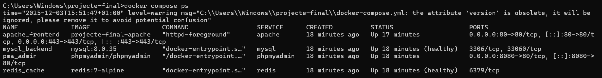
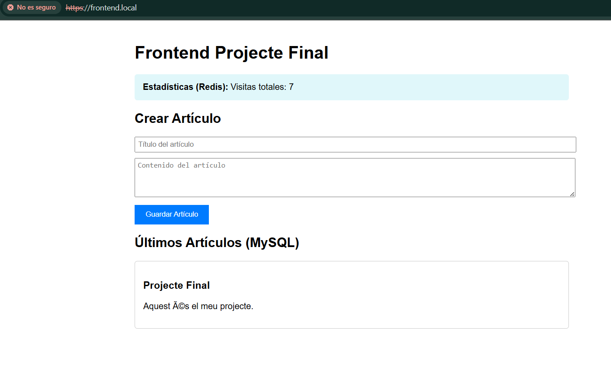
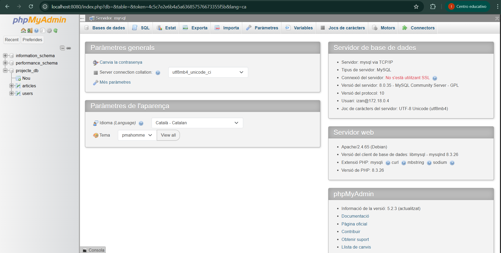
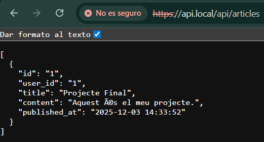
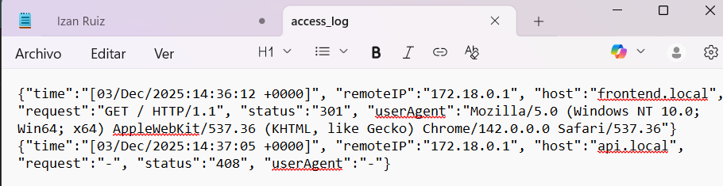

# Projecte Final d'Integració - Izan Ruiz

## Descripció
Aquest projecte consisteix en el desplegament d'una arquitectura web completa utilitzant Docker Compose. L'stack inclou un servidor web Apache amb SSL, base de dades MySQL, cache amb Redis i gestió via phpMyAdmin.

## Instruccions de Desplegament

1.  **Configuració de Hosts:**
    Afegir al fitxer hosts (`C:\Windows\System32\drivers\etc\hosts`):
    ```text
    127.0.0.1 frontend.local
    127.0.0.1 api.local
    ```

2.  **Arrencar l'Stack:**
    ```bash
    docker-compose up -d --build
    ```

3.  **Credencials:**
    *   MySQL/phpMyAdmin: Usuari `izan` / Password `secret`

---

## Evidències del Projecte 

A continuació es mostren les comprovacions amb captures de pantalla:

### 1. Docker Compose PS 
*Captura mostrant tots els serveis actius i els healthchecks superats.*


### 2. Navegador accedint a https://frontend.local 
*Accés al Virtual Host segur amb certificat auto-signat, mostrant dades de Redis i MySQL.*


### 3. phpMyAdmin 
*Visualització de l'estructura de la base de dades i les taules `users` i `articles`.*


### 4. Output de l'API 
*Resposta de l'endpoint `/api/articles` retornant les dades en format JSON.*


### 5. Logs d'Apache
*Registres de peticions del servidor mostrant el format JSON personalitzat.*

